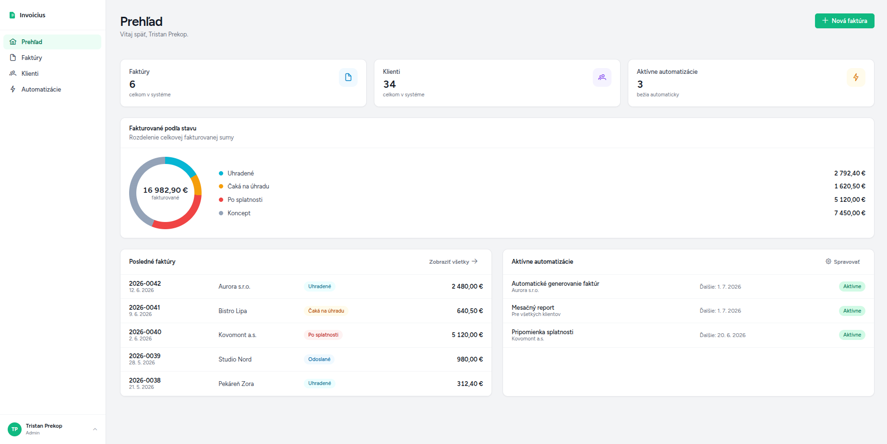
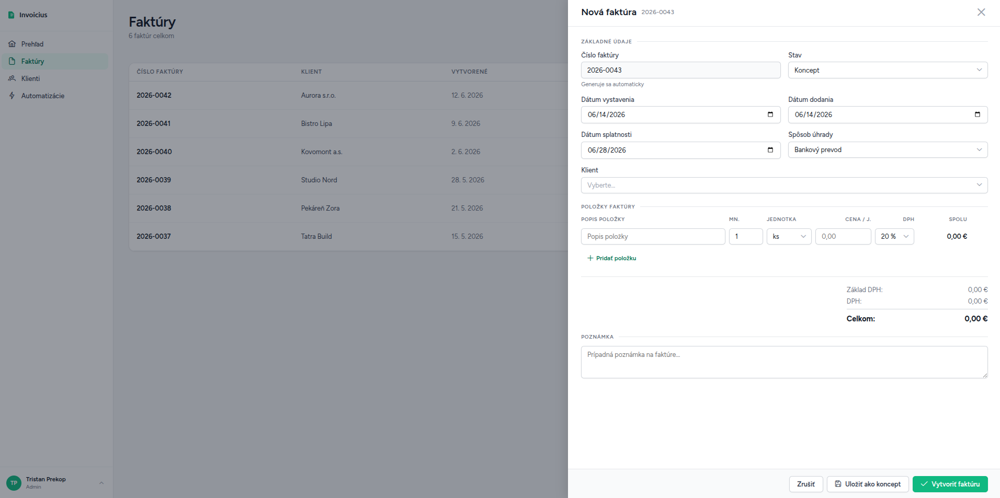
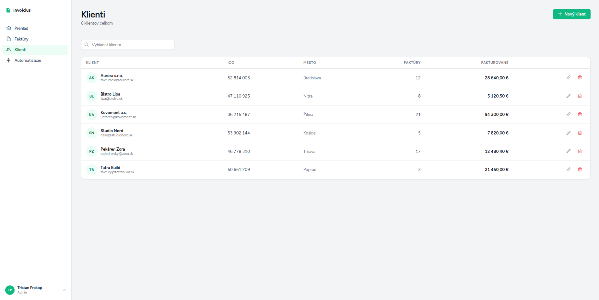
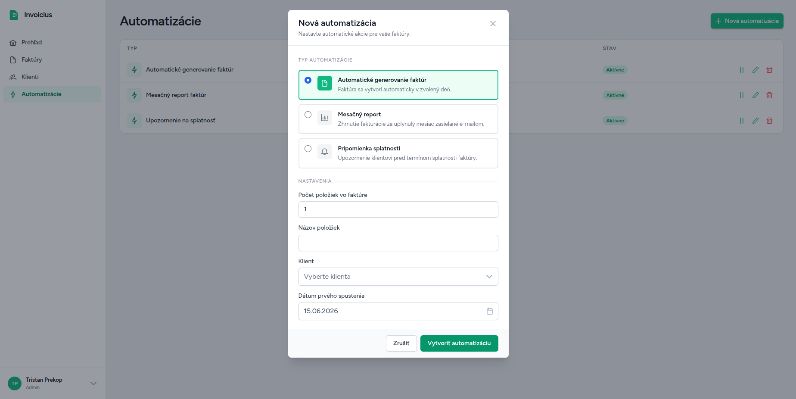

# Invoicius

Invoicing web application – invoice and client management, PDF export, automations via n8n.

**Web:** [invoicius.online](https://invoicius.online)

## Screenshots

<table>
  <tr>
    <td></td>
    <td></td>
  </tr>
  <tr>
    <td></td>
    <td></td>
  </tr>
</table>

## Stack

| Layer | Technologies |
|--------|-------------|
| Backend | PHP 8.2+, Laravel 12 |
| Frontend | Vue 3, TypeScript, Inertia.js, Tailwind CSS, PrimeVue |
| Database | MySQL 8 |
| Automations | n8n (cron → webhook → Laravel API) |
| Infra | Docker, GitHub Actions → GHCR → Ubuntu server |

## Features

- **Dashboard** – KPI stats, invoice status chart, recent invoices, active automations
- **Invoices** – list, create/edit (line items, VAT, recipient), status changes, PDF export, QR payment
- **Clients** – CRUD, linked to invoices
- **Automations** – monthly report, automatic invoice generation, due-date reminders
- **Profile** – billing details, logo and invoice color

## Architecture

```
app/
├── Automatizations/Handlers/   # handler per automation type
├── DTOs/                       # typed data between layers
├── Http/Controllers/           # thin — orchestration only (Web + Api)
├── Policies/                   # ownership enforcement
└── Services/                   # business logic (InvoiceService, AutomatizationProcessor, …)

resources/js/
├── Components/                 # shared components
├── Layouts/
└── Pages/                      # Dashboard / Invoices / Recipients / Automatizations / Profile
    └── <Feature>/
        ├── Components/
        ├── Composables/        # useXxxForm (Inertia useForm wrappers)
        └── Utils/              # defaults, helpers
```

**Automations:**
```
n8n (cron)  →  POST /api/automatizations/process  →  AutomatizationProcessor  →  Handlers
                        ↑ auth: N8N_USER header + N8N_TOKEN
```

## Quick start

```bash
git clone https://github.com/3s7an/invoicius.git && cd invoicius
cp .env.example .env
npm run docker:dev
docker compose -f docker-compose.yml -f docker-compose.dev.yml exec app php artisan db:seed
```

The application runs at `http://localhost:8080`, test account: `test@example.com` / `password`.

## Commands

### Development

```bash
npm run docker:dev          # starts the full dev stack (app + mysql + n8n + vite HMR)
npm run types                # regenerates resources/js/types/index.ts (after every merge)
```

### Testing

```bash
npm run test:all            # FE (typecheck + lint) + BE (PHPUnit) — local
npm run test:fe             # FE only: vue-tsc + ESLint
npm run docker:test:all     # FE + BE tests via Docker
npm run docker:analyse      # PHPStan / Larastan (doesn't need a running app container)
```

### Build & analysis

```bash
npm run build                # production Vite build
npm run docker:rector:dry    # Rector refactors — preview
npm run docker:rector        # Rector refactors — apply
```

## Deploy

Push to `main` → GitHub Actions: BE tests + FE tests (parallel) → Docker image → GHCR → SSH deploy → `php artisan migrate --force`.

Secrets: `SERVER_IP`, `SSH_PRIVATE_KEY`, `GITHUB_TOKEN`.
